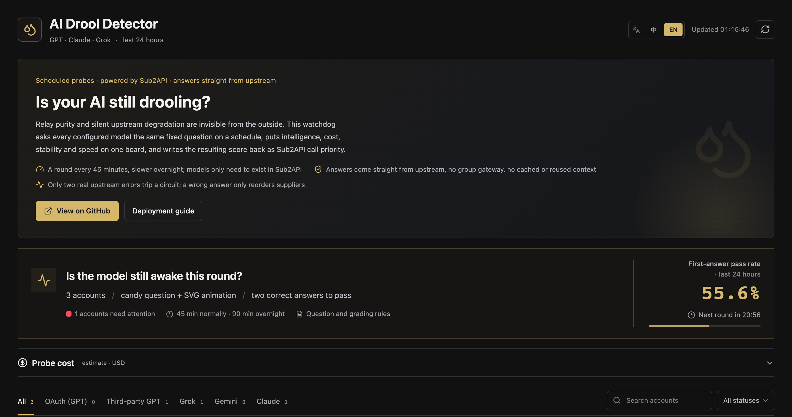

<div align="center">

<h1>💧 Drool Detector &amp; Router</h1>

<strong>Is your AI still drooling?</strong>

<p>Score who got dumber · catch who is watering it down · route traffic to whoever still delivers</p>

<p>
  <a href="https://noonwake-ai.github.io/drool-detector/"><strong>Live demo</strong></a> ·
  <a href="docs/install.en.md"><strong>Let an AI install it</strong></a> ·
  <a href="README.md">简体中文</a> ·
  <a href="#two-problems-that-keep-you-up-at-night">What it solves</a> ·
  <a href="#how-it-mates-with-sub2api">Sub2API integration</a> ·
  <a href="#deploy">Deploy</a>
</p>

<p>
  
  
  
  
</p>

</div>



---

## Paste this one line into your AI

```
Deploy Drool Detector & Router for me: https://raw.githubusercontent.com/noonwake-ai/drool-detector/main/docs/install.en.md
```

Hand it to whatever you have around — Codex, Claude Code, Cursor, Windsurf, anything that can run a command.

It reads the deployment guide, asks you exactly three things (**gateway URL, admin key, which machine**), and installs it. Then it verifies its own work: first it syncs the account list only, which **costs zero tokens**, and only then runs real probes.

It will not write your key into a log, will not touch what was already on your box, and will not change your gateway's call priority behind your back.

> Not ready to let anything near your server? Open the **[live demo](https://noonwake-ai.github.io/drool-detector/)** first.
> Nothing to install, no key, no cost — you just cannot press the buttons there.

---

## Two problems that keep you up at night

**One: the official model got dumber on its own.**

Fine last week, nonsense this week. You cannot tell whether it is your imagination
or genuine degradation — and the vendor will never tell you. By the time you are sure,
you have already written a week of code with it.

**Two: the relay is watering it down.**

You paid for Claude. Something cheaper may be answering.
A relay does not have to lie to you for long — just swap the backend while you are not
looking. Your client **always says 200**, and the answer still reads fine.

What these share: **you cannot find either one by feel.**

## What it actually does

On a fixed schedule it walks up to every model you have configured with **the same candy
puzzle** and **the same drawing task**.

The candy puzzle has a definite answer (21), so right and wrong are unambiguous.

The drawing task asks for an HTML animation of a big flamingo and a small flamingo on a
tandem bicycle — **you can judge that with your own eyes**, no evaluation expertise needed.

Who answered, who missed, who crawled, who just errored out: all recorded, all drawn on a timeline.

**Then it turns that ledger into Sub2API call priority: the good ones go first, the drooling ones go last.**

## Three things it is actually good at

### 1. See who is smart, at a glance

No opaque benchmark numbers.

Did it answer the candy question? Does the flamingo look like a flamingo?
**You can tell instantly.** Put different models and different suppliers side by side and
the ranking is obvious.

### 2. Watch degradation and dilution over time

Every supplier gets a 24-hour timeline.

Passed today, missed tomorrow, passed again the day after — you can see **when it started
going bad**, instead of one day realising something feels off.

It works on official accounts too: OAuth subscriptions degrade just as happily.

### 3. Route automatically, so every dollar lands

Four factors combine into a score:

| Factor | Weight | Measured from |
|---|---|---|
| Intelligence | 36% | how it does on the candy question |
| Cost | 36% | the supplier rate multiplier you enter; lower is cheaper |
| Stability | 18% | request success rate over recent rounds |
| Speed | 10% | time to first token, and tokens per second |

The composite score becomes a **Sub2API call priority**.

Whoever is fast, stable, cheap and genuinely capable sorts to the top — computed from
**measured results**, not from marketing claims. Together with Sub2API's own priority and
sticky weighting, new traffic goes to whoever is strongest right now.

**You do not tune it by hand, and you do not gamble on which supplier is good today.**

> Stated plainly: this is a **targeted reasoning probe**, not a full model evaluation.
> It answers one very specific question — is this supplier still delivering the level it should?

---

## How it mates with Sub2API

**Straight up: this is not an optional dependency. It is a deep coupling.**

The project keeps no account pool of its own and stores no upstream credentials. It treats
Sub2API as **the one and only account and scheduling authority**. Put differently:
**without Sub2API it does not even know who to ask.**

One full loop looks like this:

```
                     (1) read accounts, groups, rates
                    ┌────────────────────────────┐
                    │   Sub2API (your gateway)    │
                    │   accounts · groups ·       │
                    │   priority · rate multiplier│
                    └──────┬──────────────▲────────┘
                           │              │
                     (2) get creds   (5) write priority back
                           │              │
                           ▼              │
   ┌───────────────────────────────────────────────────────┐
   │  Drool Detector & Router                               │
   │                                                        │
   │  (3) call upstream directly with the account's own key │
   │      so the answer is the real one, not a gateway-     │
   │      routed (possibly diluted) copy                     │
   │                                                        │
   │  (4) grade the candy puzzle + render the artwork,       │
   │      then weight the four factors into one score         │
   └───────────────────────┬───────────────────────────────┘
                           │
                           ▼
                   public board (read-only, bilingual)
```

Exactly what it needs from Sub2API, and what breaks without it:

| What it needs | What for | Without it |
|---|---|---|
| **Admin API key** | read accounts and model config; write scores back to priority | cannot install — this is the only credential entry point |
| **Groups** | define which accounts get probed | you would probe everything, including the image-generation group you do not want |
| **Accounts + upstream credentials** | call upstream with that account's own key and proxy | you would only measure gateway-routed second-hand answers |
| **Priority field** | receive the score | you can look, but nothing routes |
| **Sticky weighting / advanced scheduling** | make new traffic prefer the top-scoring supplier | scores still compute, but traffic will not follow them |

### Why it must call upstream directly

This is the single most important design decision in the project.

If a probe went through the Sub2API group gateway, *which* backend answered would be decided
by whatever routing was in force at that moment. You would be measuring a **random** supplier,
not the one you meant to measure.

So it bypasses the gateway entirely: it takes the account's own credentials and proxy and
calls **the upstream configured on that account**.

That is what makes the result the **real** behaviour of that supplier.

> The trade-off: your host must be able to reach those upstreams directly.
> A proxy configured inside Sub2API is for Sub2API — it does not follow automatically unless
> it is stored on the account and readable.

### Why groups matter

A gateway normally mixes several kinds of account:

- official OAuth subscriptions (quota-limited)
- third-party relays (billed by a rate multiplier)
- accounts dedicated to image generation

**You usually only want to probe a subset.** Groups draw that line:

```jsonc
"platforms": {
  "openai": {
    "group_ids": [4],                   // only probe group 4
    "exclude_names": ["生图", "image"]   // never touch anything matching these names
  }
}
```

An empty `group_ids` means "every account on this platform". Name exclusions always win —
image-generation accounts never take part in call scheduling.

### How a score becomes a priority

```
intelligence 36% ┐
cost         36% ├─► composite 0–100 ─► priority = 100 + round((100 − composite) × 1000)
stability    18% │
speed        10% ┘
```

In Sub2API, **smaller numbers are called first**. The highest composite therefore gets the
smallest priority number and is picked first.

Once `routing.write_priority` is on, this syncs automatically after every round.

### By default it does not touch your gateway

`write_priority` and `write_callable` both **default to `false`**.

Install it, leave it running: it scores and displays, and **not one byte is written to your
gateway**. Watch a few rounds, confirm the scores match your expectations, and only then turn
the switches on.

Those switches are also **owned by the config file** — neither a CLI flag nor a systemd unit
can override them.

## Highlights

| | |
|---|---|
| 🎯 **Fixed questions, comparable results** | The same candy question and the same SVG animation task every round, comparable across time and suppliers |
| 🔁 **Two independent requests** | A pass requires two brand-new requests both answering correctly. A definite wrong first answer ends the round immediately instead of burning a second call |
| 🧠 **Budget cut vs upstream failure** | A stream that keeps delivering data until the client budget runs out is recorded as a budget cut — not an outage, and it never opens a circuit |
| 🚦 **Honest circuits** | Only two consecutive real upstream errors stop a supplier. Local misconfiguration, an interrupted worker and an ungradable answer never misfire |
| ⚡ **Composite scoring** | intelligence 36% / cost 36% / stability 18% / speed 10%, every weight configurable |
| 💰 **Cost ledger** | Per-request usage with the price snapshot in force at the time, summed per platform over 24 hours and 30 days |
| 🌏 **Bilingual UI** | Simplified Chinese by default with a one-click English toggle; `?lang=en` also works as a direct link |
| 🔒 **Credentials never reach the browser** | The dashboard only ever sees a redacted public projection |
| 🧩 **Any model** | Five wire protocols built in: OpenAI Responses, Chat Completions, Anthropic, Gemini, xAI. **Any OpenAI-compatible relay (Moonshot, DeepSeek, Qwen, Volcengine, OpenRouter…) needs config only, no code change** |

## How it works

```
                    ┌──────────────────────────────┐
                    │   Sub2API (your gateway)      │
                    │   accounts · groups · priority │
                    └───────────┬──────────────────┘
                                │ admin API (read + one narrow write)
                                ▼
   ┌────────────────────────────────────────────────────┐
   │  AI Drool Detector worker                           │
   │  1. Pull accounts, pick the models to probe          │
   │  2. Call upstream directly with that account's creds │
   │  3. Run the candy and SVG tasks; record the metrics  │
   │  4. Score, then write call priority (optional)       │
   └───────────┬────────────────────────┬───────────────┘
               │ public projection      │ narrow write
               ▼                        ▼
   ┌────────────────────┐    ┌──────────────────────┐
   │  Public dashboard   │    │  Sub2API call priority│
   │  bilingual · no creds│    │  circuits / recovery  │
   └────────────────────┘    └──────────────────────┘
```

Three processes, none sharing credentials:

| Process | Job | What it can read |
|---|---|---|
| `detector.monitor` | scheduled probes, scoring, optional writes | Sub2API admin key (this process only) |
| `detector.server` | read-only dashboard plus a scoped pause endpoint | the public data directory only — **no private database, no credentials** |
| `detector.pricing_tick` | recompute priority when a rate changes | Sub2API admin key (this process only) |

## Five-minute setup

### 1. What you need

- A running **Sub2API** — the probe reads accounts and routes through it
- A small Linux box with Python 3.10+ and Node 20+ (1 vCPU / 1 GB is plenty)
- A **Sub2API administrator API key**

> Generate the key in your Sub2API admin settings and use it only for this project. Do not reuse a key you use elsewhere.

### 2. Install

```bash
git clone https://github.com/noonwake-ai/drool-detector.git
cd drool-detector

python3 -m pip install -r detector/requirements.txt

cd web && npm ci && npm run build && cd ..
```

### 3. Configure

```bash
cp config.example.json config.json
```

Change at least these three things:

```jsonc
{
  "base_url": "https://your-sub2api-host",  // your gateway
  "data_dir": "./data",                     // where runtime state lives
  "platforms": {
    "openai": {
      "enabled": true,
      "model": "gpt-6-astra",               // what you want probed
      "effort": "medium",                   // reasoning effort
      "group_ids": [],                      // empty = every account on this platform
      "exclude_names": ["生图", "image"]     // name match = skip
    }
  }
}
```

**Group scope**: leave `group_ids` / `group_names` empty to probe every account on that platform. Fill them in to narrow the set. `exclude_names` always wins — list keywords there to keep image-generation accounts out.

**Models**: use the model names that actually exist in your Sub2API. To add another supplier, add another block:

```jsonc
"moonshot": {
  "enabled": true,
  "label": "Kimi",
  "model": "kimi-k3",
  "effort": "max",
  "protocol": "openai_chat"
}
```

**What `protocol` means**: it selects the wire protocol for that supplier. You can omit it — `openai`, `anthropic`, `gemini` and `grok` pick their native protocol automatically, and **any other name is treated as OpenAI-compatible Chat Completions**, so mainstream relays work out of the box.

| protocol | When to use it |
|---|---|
| `openai_chat` | The default. Anything exposing `/v1/chat/completions`: Moonshot, DeepSeek, Qwen, Volcengine, OpenRouter, SiliconFlow… |
| `openai_responses` | OpenAI-compatible services exposing `/v1/responses` |
| `anthropic_messages` | Claude's `/v1/messages` |
| `gemini_generate` | Gemini's `streamGenerateContent` |
| `xai_responses` | xAI's `/v1/responses` |

An unknown protocol name fails at startup rather than degrading silently.

### 4. Look at it for free first

```bash
python3 scripts/dev_preview.py
# open http://127.0.0.1:4191/
```

This preview uses locally generated fake data. It **never contacts your gateway, costs nothing, and needs no credentials**. Confirm the UI looks right before going further.

### How the online demo is built

The static snapshot in [demo/](demo/) **is a build artefact that is committed on purpose** — GitHub Pages publishes it directly.

```bash
python3 scripts/build_demo.py          # regenerate demo/
python3 scripts/build_demo.py --check  # what CI runs: fail if it drifts from source
```

What it does:

- builds the frontend with `DROOL_BASE=./` so every asset and endpoint path is relative and the bundle works from a subdirectory such as `/<repo>/`
- writes the synthetic `dev_preview` dataset to `demo/api/state`, `demo/api/runs/<id>` and `demo/artifacts/<id>.html`
- injects a `drool-demo` marker so the client shows the demo banner and disables every control
- anchors all timestamps to a fixed instant, so the output is byte-reproducible and `--check` can actually detect drift

**The demo contains no real data, no credentials and no gateway address.** CI re-runs the secret scan and the public-projection check before publishing.

### 5. Run it for real

```bash
export SUB2API_ADMIN_KEY='your-admin-key'

# Sync the account list only, with zero model requests (recommended first run)
python3 -m detector.monitor --metadata-only

# Run one real round
python3 -m detector.monitor --source initial
```

Then serve the board with real data:

```bash
python3 -m detector.server --dist web/dist --public ./data/public
```

> A real round spends tokens. To validate cheaply, keep one platform enabled or scope `group_ids` to one or two accounts.

## Deploy

### Option 1: Docker (simplest)

```bash
cp config.example.json config.json      # set base_url and platforms
printf 'SUB2API_ADMIN_KEY=your-key\n' > .env

docker compose up -d
# open http://127.0.0.1:4191/
```

To look at the UI only — no gateway, no spend:

```bash
docker compose run --rm --service-ports web preview
```

The image runs three services: `web` (read-only board), `worker` (scheduled probes) and `pricing` (recomputes priority when a rate changes). **Only worker and pricing receive the key; web never does.** State lives in the `drool-data` volume.

### Option 2: systemd

Ready-made systemd units live in `deploy/`.

```bash
sudo install -d -m 0755 /opt/drool-detector
sudo install -d -m 0750 /var/lib/drool-detector
sudo install -d -m 0750 /etc/drool-detector

# Code under /opt/drool-detector/current (symlink to a versioned dir for rollback)
# Config at /etc/drool-detector/config.json

sudo install -m 0600 deploy/drool-detector.env.example /etc/drool-detector/drool-detector.env
sudoedit /etc/drool-detector/drool-detector.env   # put the real key here

sudo install -m 0644 deploy/systemd/*.service /etc/systemd/system/
sudo install -m 0644 deploy/systemd/*.timer   /etc/systemd/system/
sudo systemctl daemon-reload
sudo systemctl enable --now drool-detector-web.service
sudo systemctl enable --now drool-detector-worker.timer drool-detector-sync.timer drool-detector-pricing.timer
```

| Unit | Cadence | Purpose |
|---|---|---|
| `drool-detector-worker.timer` | every 15 min | the worker decides whether a scheduled slot is due |
| `drool-detector-sync.timer` | daily at 04:00 | refresh the account list, **no model requests** |
| `drool-detector-pricing.timer` | every minute | recompute priority when a rate changes |
| `drool-detector-web.service` | always on | the read-only dashboard |

Put a reverse proxy in front (Caddy / Nginx); see `deploy/Caddyfile.fragment`.

**Rollback**: `current` is a symlink. Point it at the previous release directory and restart `drool-detector-web`. No data or control file changes are needed.

## Configuration reference

### Cadence

```jsonc
"schedule": {
  "timezone": "Asia/Shanghai",
  "regular_minutes": 45,
  "quiet_start": "04:00",
  "quiet_end": "08:00",
  "quiet_minutes": 90,
  "history_hours": 24
}
```

### Timeout budgets

```jsonc
"budgets": {
  "default_seconds": 900,
  "idle_seconds": 120,
  "gemini_high_idle_seconds": 300,
  "drawing_platform_seconds": {"grok": 1500},
  "max_attempts": 3
}
```

High-effort models can spend well over ten minutes reasoning before emitting the first body character on the drawing task. **Do not lower `default_seconds`** — the budget running out is recorded as a budget cut and that round does not pass. Widen `drawing_platform_seconds` for slow platforms instead.

### Scoring

```jsonc
"routing": {
  "weights": {"intelligence": 0.36, "cost": 0.36, "stability": 0.18, "speed": 0.10},
  "rounds": 3,
  "write_priority": false,   // default: score only, never touch your gateway
  "write_callable": false    // default: no circuit or recovery writes
}
```

> **The default is observe-only, and this switch is authoritative**: neither a CLI flag nor a systemd unit can override it. A write happens only when config sets the switch to `true` **and** the matching `--enable-*` flag is passed. Turn both on once the scores match your expectations.

### Privacy

```jsonc
"privacy": {
  "account_names": "full"   // full | alias | masked
}
```

The board shows account names, which often reveal the real upstream. Before a public deployment, switch to `alias` (stable pseudonyms, history still lines up) or `masked` (first and last characters only).

## Security boundaries

| Boundary | How |
|---|---|
| **No keys in the browser** | The browser only receives a redacted projection: account name, platform, model, state, scores. No tokens, no base URLs, no emails |
| **Auditable projection** | `scripts/check_public_projection.py` checks the projection by field name and value shape, catching keys, JWTs, emails, private IPs and unknown hosts. CI runs it on every push |
| **No keys in Git** | `config.json`, `.env`, `credentials/` and `data/` are all ignored |
| **No keys in logs** | Every upstream error is redacted before storage — keys, tokens, emails and upstream URLs are replaced |
| **Process isolation** | The web process cannot read the private database or the credential directory, and can only write control files |
| **Model output is untrusted** | Generated HTML runs in a `sandbox allow-scripts` iframe with network, forms and framing blocked |
| **Narrow writes** | Only two Sub2API mutations exist: priority and callability. Both read back and fail loudly on mismatch |

**The anonymous pause endpoint is off by default.** With `web.public_controls` enabled, anyone who can reach the page can pause or resume an account's probing. That is fine on an internal network; for a public deployment, think it through — or keep it read-only.

## FAQ

**Is Sub2API required?**
Yes. The detector does not maintain its own account pool: accounts come from Sub2API, credentials come from Sub2API, and the routing result is written back to Sub2API. Without the gateway, the chain from "where do accounts come from" to "who provides the reserve" is broken.

**Will this get my accounts banned?**
It uses each account's own credentials and makes ordinary model requests, just on a schedule you control. The real consideration is volume — by default each platform and account gets two tasks per round. Raise `regular_minutes` or scope the probe to a few accounts if that is too much.

**Why does the first wrong answer end the round?**
A definite wrong answer is already a result; asking again only burns another call. Only a **request error** deserves a retry, because that means you never got an answer.

**What does "budget cut" mean?**
It means upstream kept streaming data (first token arrived early) but the generation did not complete inside your budget. That is your budget, not an outage, so it neither opens a circuit nor grades as a wrong answer.

**The page is empty.**
Make sure a round has run — `--metadata-only` or a real probe — so `data/public/state.json` exists. The dashboard reads that file.

**Do I need to restart after editing config?**
The worker re-reads `config.json` at every start, so the next round picks it up. Web-side changes such as port or paths need a service restart.

## Contributing

Issues and PRs are welcome. Before submitting, run:

```bash
python3 -m unittest discover -s detector/tests -t . -p 'test_*.py'
cd web && node --test src/*.test.js && npm run build
```

### The full end-to-end test

Unit tests only exercise the parts. To exercise the whole chain:

```bash
python3 scripts/e2e_smoke.py
```

It runs inside a **fully isolated sandbox** that never touches a real gateway, credential or the public internet:

- starts a fake Sub2API admin API (accounts, credentials, pricing, and the only two write endpoints this project uses)
- starts a model upstream on **real TLS** speaking OpenAI Responses SSE
- has three fake suppliers play "answers correctly", "answers 29 instead of 21" and "always HTTP 500"
- runs one complete probe round and checks every outcome: the correct one passes, the wrong one is **asked only once**, the broken one trips a circuit after two upstream errors
- brings up the dashboard and fetches `/api/state`, one record and one artwork over HTTP
- verifies the public projection carries no credentials and that the cost ledger recorded an amount
- runs a second round that first confirms **the gateway receives zero writes while the switches are off**, then turns them on and confirms the circuit write really happens and reads back

Anything that does not match exits non-zero with `E2E FAILED`. `--keep` leaves the sandbox behind for you to poke at.

### Upstream behind a private CA?

If your network has a TLS-inspecting proxy:

```jsonc
// config.json
"upstream": {"ca_bundle": "/etc/ssl/certs/your-ca.pem"}
```

or `DROOL_CA_BUNDLE=/path/to/ca.pem`. Empty means the normal trust store.

Add tests with any new behaviour. For changes touching Sub2API writes, describe your read-back verification strategy.

## License

[MIT](LICENSE) © NoonWake.AI
