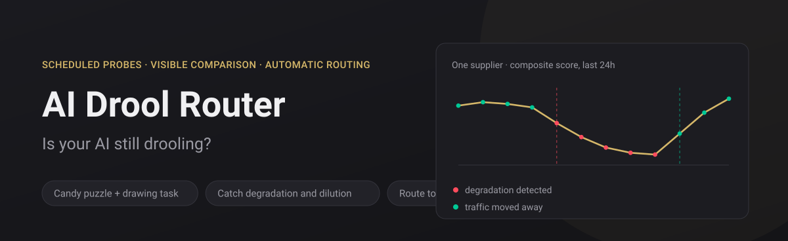
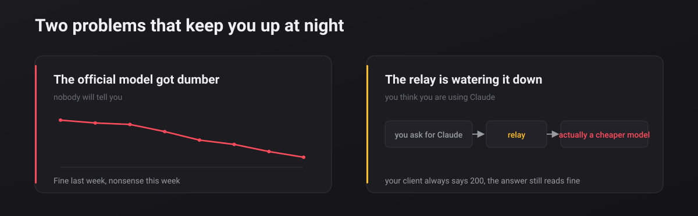
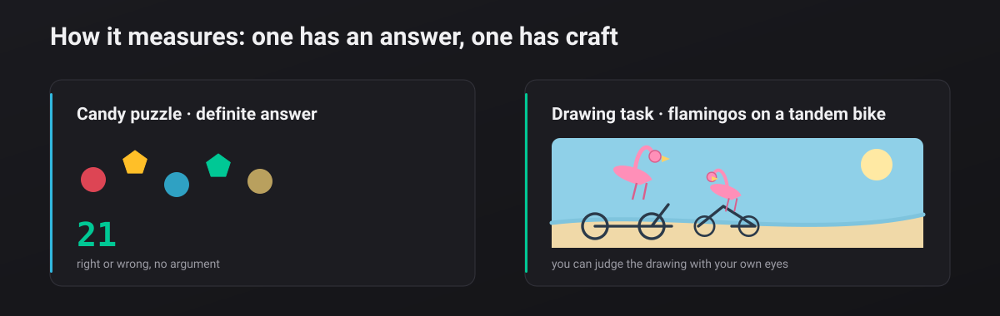
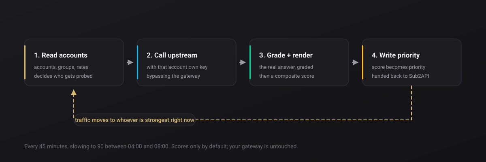
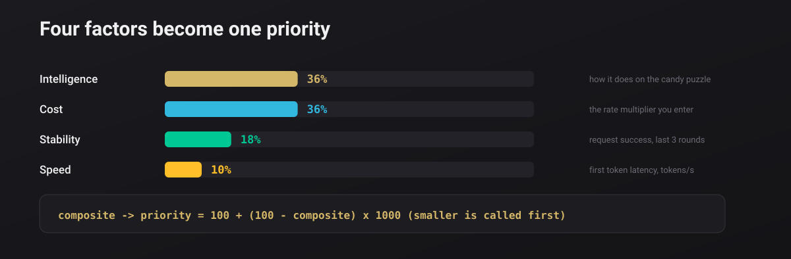
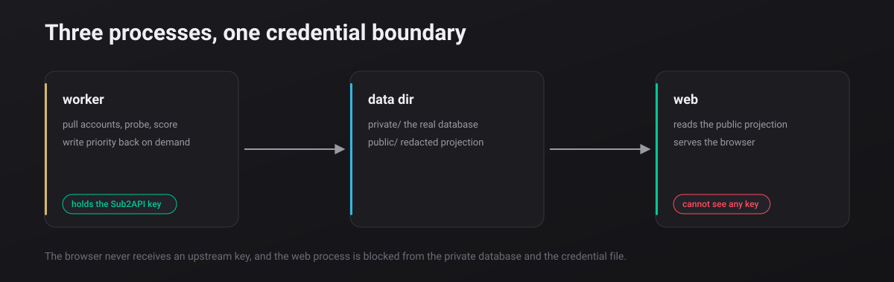

<div align="center">

<h1>💧 AI Drool Router</h1>

<strong>Is your AI still drooling?</strong>

<p>
  <a href="https://noonwake-ai.github.io/ai-drool-router/"><strong>Live demo</strong></a> ·
  <a href="docs/install.en.md"><strong>Let an AI install it</strong></a> ·
  <a href="README.md">简体中文</a>
</p>

<p>
  
  
  
</p>

</div>



## One line

Paste this into your AI. It reads the deployment guide, asks three questions, installs, and verifies itself:

```
Deploy AI Drool Router for me: https://raw.githubusercontent.com/noonwake-ai/ai-drool-router/main/docs/install.en.md
```

> Not ready to let anything near your server? Open the **[live demo](https://noonwake-ai.github.io/ai-drool-router/)** — nothing to install, no key, no cost.

---





---

## How it mates with Sub2API

**Not an optional dependency — a deep coupling.** This project stores no accounts and no keys.
Without Sub2API it does not even know who to ask.



| It needs from Sub2API | Without it |
|---|---|
| **Admin API key** | cannot install — the only credential entry point |
| **Groups** | you would probe every account, including the image ones |
| **Accounts + upstream credentials** | you would only measure gateway-routed second-hand answers |
| **Priority field** | you can look, but nothing routes |

**Why it must call upstream directly**: through the group gateway, *which* backend answers is
decided by whatever routing is in force at that moment — you would be measuring a random supplier.
So it takes each account's own key and calls the upstream configured on it, which is what makes
the result the **real** behaviour of that supplier.





---

## Quick start

```bash
git clone https://github.com/noonwake-ai/ai-drool-router.git && cd ai-drool-router
python3 -m pip install -r detector/requirements.txt
cd web && npm ci && npm run build && cd ..

cp config.example.json config.json             # base_url, platforms, models
export SUB2API_ADMIN_KEY='your-admin-key'

python3 -m detector.monitor --metadata-only    # account list only, 0 tokens
python3 -m detector.monitor --source initial   # one real round
python3 -m detector.server --dist web/dist --public ./data/public
```

Just want to look at it (no gateway, no cost):

```bash
python3 scripts/dev_preview.py
```

## Docs

| Document | What it covers |
|---|---|
| [AI install guide](docs/install.en.md) | The deployment runbook an AI executes, with red lines and self-checks |
| [Deployment](docs/deploy.md) | Docker and systemd paths, upgrade and rollback |
| [Architecture](docs/architecture.md) | Three processes, data flow, error classification |
| [Contributing](CONTRIBUTING.md) | Dev setup and commit rules |
| [Security](SECURITY.md) | Security model and deployer responsibilities |

## Three boundaries worth stating

- **Scores only by default; your gateway is untouched.** `routing.write_priority` and
  `write_callable` default to `false`, and the **config file owns those switches** —
  neither a CLI flag nor a systemd unit can override them.
- **A targeted probe, not a full evaluation.** It answers one question: is this supplier still
  delivering the level it should?
- **The browser never receives a key.** Only a redacted public projection is published.

## License

**[GNU LGPL-3.0](LICENSE)** © NoonWake.AI

Use it, run it commercially, modify it — free, and you do not have to open source your own
application code. But if you **distribute a modified version of this project**, the parts you
changed must be released under LGPL-3.0 too. LGPL-3.0 incorporates GPL-3.0 by reference; the
full text ships in [COPYING](COPYING).
