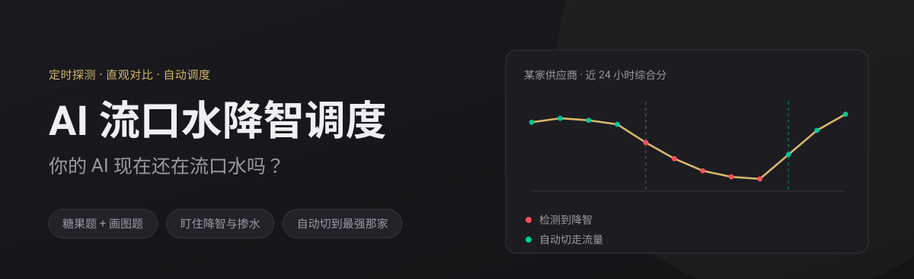
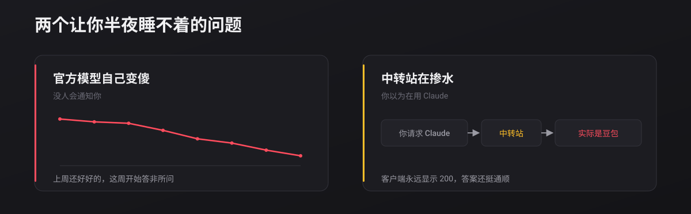
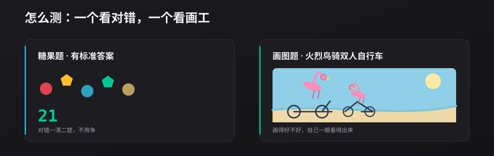
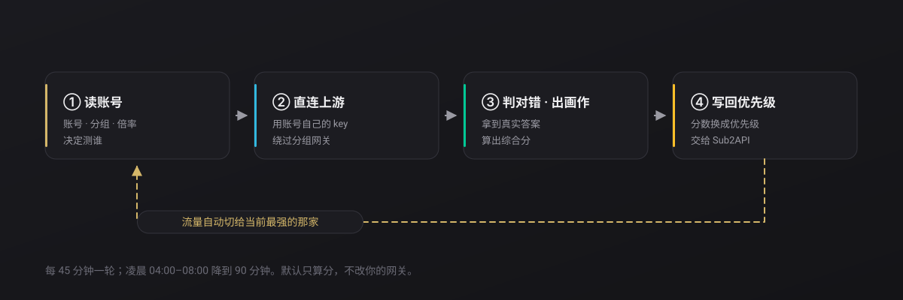
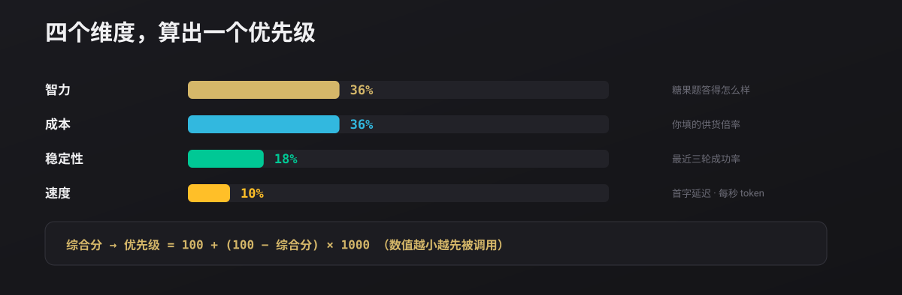
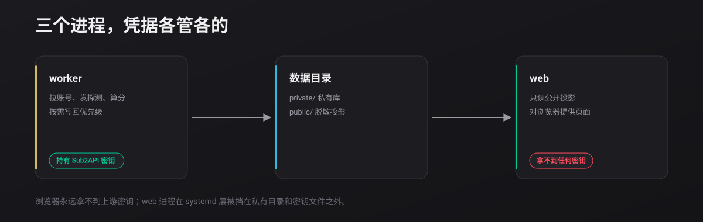

<div align="center">

<h1>💧 AI 流口水降智调度</h1>

<strong>你的 AI 现在还在流口水吗？</strong>

<p>
  <a href="https://noonwake-ai.github.io/ai-drool-router/"><strong>在线 Demo</strong></a> ·
  <a href="docs/install.md"><strong>让 AI 帮你装</strong></a> ·
  <a href="README.en.md">English</a>
</p>

<p>
  
  
  
</p>

</div>



## 一句话

把这一句发给你的 AI，它会读部署文档、问你三个问题、装完并自检：

```
帮我部署 AI 流口水降智调度：https://raw.githubusercontent.com/noonwake-ai/ai-drool-router/main/docs/install.md
```

> 不想让它碰服务器？先点 **[在线 Demo](https://noonwake-ai.github.io/ai-drool-router/)** —— 不用装、不用密钥、不花钱。

---





---

## 它和 Sub2API 怎么咬合

**这不是可选依赖，是深度绑定。** 项目自己不存账号、不存密钥——没有 Sub2API，它连「该问谁」都不知道。



| 需要 Sub2API 提供 | 缺了会怎样 |
|---|---|
| **管理员 API Key** | 装不起来，这是唯一的凭据入口 |
| **分组** | 只能全测，可能连生图账号一起测 |
| **账号 + 上游凭据** | 拿不到真实答案，只能测网关转发的二手结果 |
| **优先级字段** | 只能看，不能自动调度 |

**为什么必须直连上游**：走分组网关的话，谁回答由当时的路由决定，你测到的是「随机一家」。
所以它拿账号自己的凭据直连上游——测到的才是这家供应商**真实**的样子。





---

## 快速开始

```bash
git clone https://github.com/noonwake-ai/ai-drool-router.git && cd ai-drool-router
python3 -m pip install -r detector/requirements.txt
cd web && npm ci && npm run build && cd ..

cp config.example.json config.json             # 填 base_url、平台、模型
export SUB2API_ADMIN_KEY='你的密钥'

python3 -m detector.monitor --metadata-only    # 只拉账号，0 token
python3 -m detector.monitor --source initial   # 跑一轮真实检测
python3 -m detector.server --dist web/dist --public ./data/public
```

只想看看界面（不连网关、不花钱）：

```bash
python3 scripts/dev_preview.py
```

## 常用文档

| 文档 | 讲什么 |
|---|---|
| [AI 安装指引](docs/install.md) | 写给 AI 执行的部署流程，含红线与自检 |
| [部署手册](docs/deploy.md) | Docker / systemd 两条路线，升级与回滚 |
| [架构说明](docs/architecture.md) | 三个进程、数据流、错误分类 |
| [参与贡献](CONTRIBUTING.md) | 开发环境与提交规范 |
| [安全策略](SECURITY.md) | 安全模型与部署方责任 |

## 三条必须说清的边界

- **默认只算分，不改网关。** `routing.write_priority` 与 `write_callable` 默认 `false`，
  而且**由配置文件说了算**——命令行和 systemd 单元都绕不过去。
- **这是定向探针，不是完整评测。** 它只回答一个问题：这家供应商现在还在稳定输出它该有的水平吗。
- **浏览器永远拿不到密钥。** 页面上只有脱敏后的公开投影。

## 许可

**[GNU LGPL-3.0](LICENSE)** © NoonWake.AI

自用、商用、改造都免费，也不用开源你自己的业务代码；
但**改了它本身再分发，改动的部分要以 LGPL-3.0 开源**。
LGPL-3.0 引用了 GPL-3.0，完整原文见 [COPYING](COPYING)。
