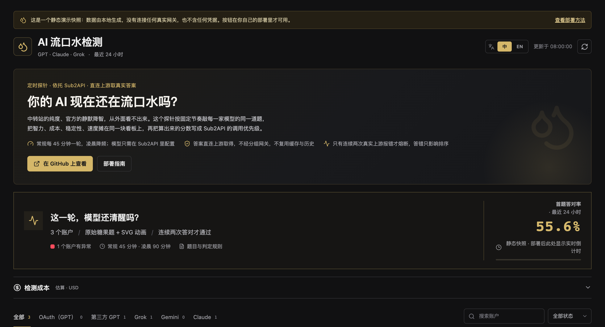

<div align="center">

<h1>💧 流口水降智检测与智能调度</h1>

<strong>你的 AI 现在还在流口水吗？</strong>

<p>测出谁在变傻 · 盯住谁在掺水 · 自动把流量切给最能干的那家</p>

<p>
  <a href="https://noonwake-ai.github.io/drool-detector/"><strong>在线 Demo</strong></a> ·
  <a href="docs/install.md"><strong>让 AI 帮你装</strong></a> ·
  <a href="README.en.md">English</a> ·
  <a href="#两个让你半夜睡不着的问题">解决什么问题</a> ·
  <a href="#它和-sub2api-到底怎么咬合">与 Sub2API 的关系</a> ·
  <a href="#部署">部署</a>
</p>

<p>
  
  
  
  
</p>

</div>



---

## 先把这一句发给你的 AI

```
帮我部署流口水降智检测与智能调度：https://raw.githubusercontent.com/noonwake-ai/drool-detector/main/docs/install.md
```

复制给你手边的 AI（Codex、Claude Code、Cursor、Windsurf……能敲命令的都行）。

它会自己读完部署说明，问你三个问题——**网关地址、管理员密钥、装哪台机器**——然后动手装。
装完还会自己验一遍：先只拉账号清单，**一个 token 都不花**，确认范围对了，再跑真正的检测。

它不会把密钥写进日志，不会碰你机器上原有的东西，也不会自作主张去改你网关的调用优先级。

> 不想让它碰服务器？先点开 **[在线 Demo](https://noonwake-ai.github.io/drool-detector/)**。
> 不用装、不用密钥、不花钱，就是不能点按钮。

---

## 两个让你半夜睡不着的问题

**一、官方模型自己变傻。**

上周还好好的，这周开始答非所问。你分不清是自己错觉，还是它真降智了——
官方永远不会告诉你。等你确认的时候，可能已经拿它写了一星期代码。

**二、中转站在掺水。**

你付的是 Claude 的钱，回你话的可能是豆包。
中转站不用骗你很久，只要在你没注意的时候换个后端就行，
而你的客户端**永远显示 200**，答案读起来也挺通顺。

这两个问题的共同点是：**靠感觉发现不了。**

## 这个项目干什么

它按固定节奏，拿**同一道糖果题**和**同一道画图题**，挨个去问你家每一个模型。

糖果题有标准答案（21），对错一清二楚。

画图题让模型画一只大火烈鸟和一只小火烈鸟骑双人自行车——
**画得好不好，你自己一眼就看得出来**，不需要任何评测知识。

谁答对了、谁答错了、谁慢慢吞吞、谁直接报错，全部记下来，画成时间线。

**然后它把这笔账算进 Sub2API 的调用优先级：好的排前面，流口水的排后面。**

## 三个核心能力

### 一、直观地看出谁聪明

不给你看晦涩的 benchmark 分数。

糖果题答对没有、火烈鸟画得像不像，**一眼就知道**。
不同模型、不同供应商摆在一起，谁强谁弱一目了然。

### 二、盯住降智和掺水

每家供应商一条 24 小时时间线。

今天过了、明天没过、后天又过了——
你能看到它是**从什么时候开始变差的**，而不是某天突然觉得"好像不太对"。

对官方账号同样有效：OAuth 账号也会降智，也要盯。

### 三、自动调度，钱花在刀刃上

综合四个维度打分：

| 维度 | 权重 | 看什么 |
|---|---|---|
| 智力 | 36% | 糖果题答得怎么样 |
| 成本 | 36% | 你填的供货倍率，越低越便宜 |
| 稳定性 | 18% | 最近几轮请求的成功率 |
| 速度 | 10% | 首字多久到、每秒吐多少 token |

算出的综合分换算成 **Sub2API 的调用优先级**。

哪家又快又稳又便宜又真聪明，系统按**实测算出来的结果**排序，
配合 Sub2API 自己的优先级和粘性加权，新流量优先走当前最强的那家。

**你不用手动调，也不用赌哪家今天靠谱。**

> 说清边界：这是一个**定向推理探针**，不是完整模型评测。
> 它回答的是一个非常具体的问题——这家供应商，现在还在稳定输出它该有的水平吗。

---

## 它和 Sub2API 到底怎么咬合

**先说清楚：这不是"可选依赖"，是深度绑定。**

这个项目自己不维护账号池，也不存任何上游密钥。它把 Sub2API 当成**唯一的账号和调度中枢**。
换句话说：**没有 Sub2API，它连"该问谁"都不知道。**

一次完整的闭环长这样：

```
   ① 读账号、读分组、读倍率
   ┌─────────────────────────────┐
   │ Sub2API（你的网关）         │
   │ 账号 · 分组 · 优先级 · 倍率 │
   └────────┬──────────────────▲─┘
            │                  │
            ② 拿账号凭据       ⑤ 写回优先级
            │                  │
            ▼                  │
   ┌───────────────────────────────────────────────────┐
   │ 流口水降智检测与智能调度                          │
   │                                                   │
   │ ③ 用账号自己的 key 直连上游，绕过分组网关         │
   │    拿到真实答案（不是网关转发的、可能掺水的那份） │
   │                                                   │
   │ ④ 糖果题判对错 + 画图题出成品，加权算综合分       │
   └───────────────────────────────────────────────────┘
            │
            ▼
            公开看板（只读，中英双语）
```

每一步具体依赖什么：

| 它需要 Sub2API 提供 | 用来干什么 | 缺了会怎样 |
|---|---|---|
| **管理员 API Key** | 读账号清单和模型配置；把评分写回优先级 | 装不起来。这是唯一的凭据入口 |
| **分组（Group）** | 圈定"哪些账号要被检测" | 只能全测。你可能只想要 OpenAI 分组，不想测生图那组 |
| **账号 + 上游凭据** | 用账号自己的 key 和代理直连上游 | 拿不到真实答案，只能测网关转发的二手结果 |
| **优先级字段** | 承接评分结果 | 只能看，不能自动调度 |
| **粘性加权 / 高级调度** | 让新流量优先切到最高分的供应商 | 分数照样算，但流量切不过去 |

### 为什么必须直连上游

这是整个项目最关键的设计。

如果检测请求走 Sub2API 的分组网关，那你是谁、会拿到哪个后端的答案，
**由网关当时的路由决定**——你测到的是一家"随机"供应商，不是你想测的那一家。

所以它绕开网关：拿着账号自己的凭据、自己的代理，**直连账号配置里那个上游**。

这样测出来的才是**这家供应商真实的样子**。

> 代价是：你的服务器要能直接出网访问那些上游。
> Sub2API 里给账号配的代理是给 Sub2API 用的，不会自动带过来——除非这个代理配置
> 在账号上、能被读到。

### 为什么需要分组

一个网关里通常混着好几类账号：

- 官方的 OAuth 账号（订阅制，有额度上限）
- 各家第三方中转站（按倍率计费）
- 专门用来生图的账号

**你通常只想测其中一部分。** 分组就是用来划这条线的：

```jsonc
"platforms": {
  "openai": {
    "group_ids": [4],                  // 只测 4 号分组
    "exclude_names": ["生图", "image"]  // 名字带这些词的一律跳过
  }
}
```

`group_ids` 留空 = 该平台全部账号都测。名字排除永远优先——生图账号绝不参与调用调度。

### 分数是怎么变成优先级的

```
智力 36% ┐
成本 36% ├─► 综合分 0–100 ─► 优先级 = 100 + round((100 − 综合分) × 1000)
稳定 18% │
速度 10% ┘
```

Sub2API 里**数值越小越优先**。所以综合分最高的那家，优先级数值最小，会被最先调用。

打开 `routing.write_priority` 之后，每轮检测完就自动同步一次。

### 默认不改你的网关

`write_priority` 和 `write_callable` **默认都是 `false`**。

也就是说：装完先用着，它只算分、只展示，**一个字节都不会写进你的网关**。
等你看几轮结果、确认分数符合预期了，再打开让它接管。

而且这个开关**由配置文件说了算**——命令行参数和 systemd 单元都绕不过去。

## 核心特性

| | |
|---|---|
| 🎯 **固定题目，结果可比** | 每轮同一道糖果题，同一道 SVG 动画题。跨时间、跨供应商直接对比 |
| 🔁 **两次独立请求** | 连续两次全新请求都答对才通过。第一次明确答错立刻结束，不浪费第二次 token |
| 🧠 **预算截断 vs 上游故障** | 上游一直在返回数据但预算用完，单独记为「预算截断」，不算上游无响应、不触发熔断 |
| 🚦 **真实熔断** | 只有连续两次真实上游报错才停止调用；本地配置错误、进程中断、答案无法核验都不会误伤 |
| ⚡ **综合评分** | 智力 36% / 成本 36% / 稳定性 18% / 速度 10%，权重全部可配 |
| 💰 **成本账本** | 逐请求记录用量与当时价格快照，近 24 小时与近 30 天分平台汇总 |
| 🌏 **中英双语** | 页面默认简体中文，一键切英文；`?lang=en` 直链也可 |
| 🔒 **凭据不出后端** | 浏览器永远拿不到任何上游密钥，看板只有脱敏后的公开投影 |
| 🧩 **任何模型** | 内置 OpenAI Responses / Chat Completions / Anthropic / Gemini / xAI 五种协议。**任何 OpenAI 兼容的中转站（Moonshot、DeepSeek、Qwen、火山、OpenRouter……）加一段配置就能测，不用改代码** |

## 它是怎么工作的

```
                       ┌─────────────────────────────┐
                       │ Sub2API（你的网关）         │
                       │ 账号 · 分组 · 优先级 · 倍率 │
                       └─────────────────────────────┘
                                   │ 管理 API（只读 + 极窄写）
                                   ▼
   ┌────────────────────────────────────────────────┐
   │ 流口水降智检测与智能调度 worker                │
   │ 1. 拉取账号清单，按配置挑出要检测的模型        │
   │ 2. 用该账号自己的上游凭据直连，绕过分组网关    │
   │ 3. 跑糖果题 + SVG 动画题，记录智力/速度/稳定性 │
   │ 4. 算综合分 → 回写调用优先级（可选）           │
   └─────────┬─────────────────────────┬────────────┘
             │                         │
             只写公开投影              极窄写
             ▼                         ▼
   ┌───────────────────┐    ┌────────────────────┐
   │ 公开看板（只读）  │    │ Sub2API 调用优先级 │
   │ 中英双语 · 无凭据 │    │ 熔断 / 恢复        │
   └───────────────────┘    └────────────────────┘
```

三个独立进程，互不共享凭据：

| 进程 | 职责 | 能读到什么 |
|---|---|---|
| `detector.monitor` | 定时检测、评分、按需回写 | Sub2API 管理员密钥（仅此进程） |
| `detector.server` | 只读看板 + 受限暂停接口 | 只有公开数据目录，**看不到私有库和凭据** |
| `detector.pricing_tick` | 倍率变化时重算优先级 | Sub2API 管理员密钥（仅此进程） |

## 五分钟跑起来

### 1. 你需要准备什么

- 一个已经跑起来的 **Sub2API**（这是前提，检测靠它管理账号和路由）
- 一个能跑 Python 3.10+ 和 Node 20+ 的 Linux 小机器（1 核 1G 就够）
- 一个 **Sub2API 管理员 API Key**

> 密钥怎么拿：登录你的 Sub2API 后台，在管理员/API Key 相关设置里生成一个。它只给这个检测项目用，别复用你日常的 key。

### 2. 装依赖

```bash
git clone https://github.com/noonwake-ai/drool-detector.git
cd drool-detector

python3 -m pip install -r detector/requirements.txt

cd web && npm ci && npm run build && cd ..
```

### 3. 写配置

复制一份开始改：

```bash
cp config.example.json config.json
```

最少要改这三个地方：

```jsonc
{
  "base_url": "https://你的-sub2api-域名",   // 你的网关地址
  "data_dir": "./data",                     // 运行数据放哪
  "platforms": {
    "openai": {
      "enabled": true,
      "model": "gpt-6-astra",               // 你想测哪个模型
      "effort": "medium",                   // 思考等级
      "group_ids": [],                      // 留空＝该平台全部账号
      "exclude_names": ["生图", "image"]     // 名字命中就跳过
    }
  }
}
```

**分组怎么填**：`group_ids` / `group_names` 留空表示「这个平台的所有账号都测」。填上就只测属于这些分组的账号。`exclude_names` 永远优先——比如你不希望生图账号参与，就把关键词写进去。

**模型怎么填**：用 Sub2API 里真实存在的模型名。想加新供应商就照着加一段：

```jsonc
"moonshot": {
  "enabled": true,
  "label": "Kimi",
  "model": "kimi-k3",
  "effort": "max",
  "protocol": "openai_chat"
}
```

**`protocol` 是干嘛的**：它告诉检测器用哪种线协议跟这家上游说话。可以不填——`openai` / `anthropic` / `gemini` / `grok` 会自动选原生协议，**其他任何名字默认按 OpenAI 兼容的 Chat Completions 处理**，所以主流中转站开箱即用。

能填的值：

| protocol | 什么时候用 |
|---|---|
| `openai_chat` | 默认值。任何提供 `/v1/chat/completions` 的服务：Moonshot、DeepSeek、通义、火山方舟、OpenRouter、SiliconFlow…… |
| `openai_responses` | 提供 `/v1/responses` 的 OpenAI 兼容服务 |
| `anthropic_messages` | Claude 的 `/v1/messages` |
| `gemini_generate` | Gemini 的 `streamGenerateContent` |
| `xai_responses` | xAI 的 `/v1/responses` |

填错名字会在启动时直接报错，不会静默降级。

### 4. 先在不花钱的模式下看一眼

```bash
python3 scripts/dev_preview.py
# 打开 http://127.0.0.1:4191/
```

这个预览用的是本地造的假数据，**不会连你的网关、不花一分钱、不需要任何密钥**。先确认页面长得对，再往下走。

### 在线 Demo 是怎么来的

[demo/](demo/) 目录里那份静态快照**是构建产物，但故意提交进仓库**——GitHub Pages 直接发布它。

```bash
python3 scripts/build_demo.py          # 重新生成 demo/
python3 scripts/build_demo.py --check  # CI 用：和当前源码不一致就失败
```

它做了什么：

- 用 `DROOL_BASE=./` 构建前端，所有资源与接口路径都是相对的，
  所以放在 `/<仓库名>/` 这种子目录下也能正常打开
- 把 `dev_preview` 的合成数据落成 `demo/api/state`、`demo/api/runs/<id>`、
  `demo/artifacts/<id>.html`
- 往页面注入一个 `drool-demo` 标记：客户端据此显示演示提示条，
  并把所有控制按钮置为禁用
- 数据锚定在一个固定时间戳，所以构建结果逐字节可复现，
  CI 里 `--check` 才能真正判断"是否过期"

**Demo 里没有任何真实数据、任何密钥、任何网关地址。** 发布前 CI 还会再跑一遍密钥扫描和公开投影检查。

### 5. 真实跑一轮

```bash
export SUB2API_ADMIN_KEY='你的管理员密钥'

# 只同步账号清单，不发起任何模型请求（推荐第一次这样做）
python3 -m detector.monitor --metadata-only

# 真正跑一轮检测
python3 -m detector.monitor --source initial
```

跑完再开一次看板就能看到真实结果：

```bash
python3 -m detector.server --dist web/dist --public ./data/public
```

> 第一次真跑会消耗 token。想先小范围验证，就把 `platforms` 里只留一个平台、或者用 `group_ids` 圈一两个账号。

## 部署

### 方式一：Docker（推荐，最省事）

```bash
cp config.example.json config.json      # 改 base_url 和 platforms
printf 'SUB2API_ADMIN_KEY=你的密钥\n' > .env

docker compose up -d
# 打开 http://127.0.0.1:4191/
```

只能先看一眼界面、不花钱也不连网关：

```bash
docker compose run --rm --service-ports web preview
```

镜像分三个服务：`web`（只读看板）、`worker`（定时检测）、`pricing`（倍率变化时重算优先级）。**只有 worker 和 pricing 拿得到密钥，web 拿不到。** 数据放在 `drool-data` 卷里。

### 方式二：systemd

仓库里带了一套现成的 systemd 单元，直接抄就能用。

```bash
sudo install -d -m 0755 /opt/drool-detector
sudo install -d -m 0750 /var/lib/drool-detector
sudo install -d -m 0750 /etc/drool-detector

# 代码放到 /opt/drool-detector/current（软链到具体版本目录，方便回滚）
# 配置放到 /etc/drool-detector/config.json

sudo install -m 0600 deploy/drool-detector.env.example /etc/drool-detector/drool-detector.env
sudoedit /etc/drool-detector/drool-detector.env   # 填真实密钥

sudo install -m 0644 deploy/systemd/*.service /etc/systemd/system/
sudo install -m 0644 deploy/systemd/*.timer   /etc/systemd/system/
sudo systemctl daemon-reload
sudo systemctl enable --now drool-detector-web.service
sudo systemctl enable --now drool-detector-worker.timer drool-detector-sync.timer drool-detector-pricing.timer
```

四个定时器的分工：

| 单元 | 节奏 | 干什么 |
|---|---|---|
| `drool-detector-worker.timer` | 每 15 分钟敲一次 | 由 worker 自己判断当前是否到了检测时点 |
| `drool-detector-sync.timer` | 每天 04:00 | 同步账号清单，**不发起模型请求** |
| `drool-detector-pricing.timer` | 每分钟 | 倍率有变化时重算优先级 |
| `drool-detector-web.service` | 常驻 | 只读看板 |

前面套一层反向代理（Caddy / Nginx），示例见 `deploy/Caddyfile.fragment`。

**回滚**：`current` 是一个软链。把它指回上一个版本目录、重启 `drool-detector-web` 就行。数据库和控制文件都不用动。

## 配置项速查

### 节奏

```jsonc
"schedule": {
  "timezone": "Asia/Shanghai",
  "regular_minutes": 45,     // 常规间隔
  "quiet_start": "04:00",    // 凌晨降频开始
  "quiet_end": "08:00",      // 凌晨降频结束
  "quiet_minutes": 90,       // 凌晨间隔
  "history_hours": 24        // 看板保留多久
}
```

### 超时预算

```jsonc
"budgets": {
  "default_seconds": 900,          // 默认整次生成预算
  "idle_seconds": 120,             // 多久没有数据算断流
  "gemini_high_idle_seconds": 300, // 高思考等级放宽
  "drawing_platform_seconds": {"grok": 1500},
  "max_attempts": 3
}
```

高思考等级的模型在动画题上可能要跑十几分钟才吐出第一个正文字符。**别把 `default_seconds` 调小**——预算用完会被记成「预算截断」，那道题就不算通过。给慢平台单独在 `drawing_platform_seconds` 里放宽。

### 评分权重

```jsonc
"routing": {
  "weights": {"intelligence": 0.36, "cost": 0.36, "stability": 0.18, "speed": 0.10},
  "rounds": 3,
  "write_priority": false,   // 默认 false：只算分，不动你的网关
  "write_callable": false    // 默认 false：不做熔断/恢复写操作
}
```

> **默认是「只看不改」**，而且这个开关说了算：命令行参数和 systemd 单元都绕不过它。两个条件同时满足才会写——`config.json` 里对应开关为 `true`，**并且**启动命令带上了对应的 `--enable-*`。确认分数符合预期后，再把两处都打开。

### 隐私

```jsonc
"privacy": {
  "account_names": "full"   // full | alias | masked
}
```

看板会展示账号名，而账号名常常暴露真实上游。公网部署前可以改成 `alias`（稳定假名，历史仍能对齐）或 `masked`（只留首尾字符）。

## 安全边界

这部分请认真读，它决定了你能放心把它放在公网上。

| 边界 | 做法 |
|---|---|
| **密钥不落前端** | 浏览器只拿得到一个脱敏后的公开投影：账号名、平台、模型、状态、分数。没有 token、没有 base_url、没有邮箱 |
| **可审计的公开投影** | 仓库带 `scripts/check_public_projection.py`，按字段名和取值形态检查投影，拦密钥、JWT、邮箱、内网 IP、未知域名。CI 每次都跑 |
| **密钥不落 Git** | `config.json`、`.env`、`credentials/`、`data/` 全在 `.gitignore` 里 |
| **密钥不进日志** | 所有上游错误在写库前都会跑一遍脱敏，密钥、令牌、邮箱、上游地址全部替换 |
| **进程隔离** | Web 进程读不到私有库和凭据目录，只能写控制文件 |
| **模型输出当不可信** | 模型生成的 HTML 放在 `sandbox allow-scripts` 的 iframe 里跑，网络、表单、上级框架全部禁止 |
| **写操作极窄** | 对 Sub2API 只有两个动作：改优先级、改可调用状态。都有回读校验，读回不一致就报错 |

**匿名暂停接口默认关闭**。`web.public_controls` 打开后，任何能访问页面的人都可以暂停/恢复某个账号的检测。内网用没关系，公网部署请想清楚——或者干脆让它只读。

## 常见问题

**必须要有 Sub2API 吗？**
是。这台检测器不自己维护账号池，账号从 Sub2API 读、凭据从 Sub2API 读、路由结果写回 Sub2API。没有网关就从「从哪里拿账号」到「谁来兜底」都断了。

**会不会把我的账号封了？**
它用你这个账号自己的凭据，发起的是正常的模型请求，只是节奏由你控制。真要说风险，就是请求量——默认每个平台每个账号一轮两道题。嫌多就把 `regular_minutes` 调大，或者只圈几个账号做样本。

**第一次答错为什么要直接结束？**
因为确认答错已经是明确结果了，再问一遍只是多烧一次 token。只有**请求失败**才值得重试——那是没拿到答案，不是答错。

**为什么有时候显示「预算截断」而不是答错？**
说明上游一直在返回数据（首 token 很早就到了），但在你设的生成预算内没能完整结束。这是你的预算问题，不是上游故障，所以它既不触发熔断，也不该被当成答错。

**页面打开是空的？**
先确认跑过一次 `--metadata-only` 或真实检测，`data/public/state.json` 存在。看板读的就是这个文件。

**改完配置要重启吗？**
worker 每次启动都会重新读 `config.json`，所以下一轮生效。Web 进程的端口/路径同理，需要重启服务。

## 参与进来

Issue 和 PR 都欢迎。提交前请跑：

```bash
python3 -m unittest discover -s detector/tests -t . -p 'test_*.py'
cd web && node --test src/*.test.js && npm run build
```

### 完整的端到端测试

单元测试只碰零件。想验整条链路，跑这个：

```bash
python3 scripts/e2e_smoke.py
```

它会在**完全隔离的沙箱**里做这些事，不碰任何真实网关、凭据或公网：

- 起一个假的 Sub2API 管理接口（账号、凭据、价格，以及仅有的两个写接口）
- 起一个**真 TLS** 的模型上游，按 OpenAI Responses SSE 协议吐流
- 让三家假供应商分别扮演「答对」「答错 29」「永远 HTTP 500」
- 跑完一整个检测轮次，逐条核对结果：答对的过、答错的**只发一次请求**、报错的连续两次后熔断
- 起来看板，用 HTTP 拉一遍 `/api/state`、单条记录、画作
- 检查公开投影里没有密钥，成本账本真的记了钱
- 再跑一轮：**先把写入开关关掉，确认网关一个写请求都收不到**；然后打开开关，确认熔断写入真的发生并被回读校验

任何一条不符就报 `E2E FAILED` 并且非零退出。`--keep` 会把沙箱留着给你翻。

### 上游用的是私有 CA？

企业内网里套了 TLS 检查代理的话，把 CA 告诉它：

```jsonc
// config.json
"upstream": {"ca_bundle": "/etc/ssl/certs/your-ca.pem"}
```

或 `DROOL_CA_BUNDLE=/path/to/ca.pem`。留空就用系统默认信任库。

新增功能请带上对应测试。涉及 Sub2API 写操作的改动，请同时说明回读校验策略。

## 许可

**[GNU Lesser General Public License v3.0](LICENSE)**（LGPL-3.0）© NoonWake.AI

简单说人话：

- **自用、商用、改造，都随便你**，不用付钱，也不用开源你自己的业务代码
- 但如果你**改了它本身**、还把它分发出去（包括做成镜像对外提供），
  那你改的那部分也要以 LGPL-3.0 开源出来
- 把它当作组件用到你自己的系统里，你自己的代码不用跟着开源

LGPL-3.0 在文本上引用了 GPL-3.0，所以完整的 GPL-3.0 原文也随仓库提供一份：
[COPYING](COPYING)。

> 换句话说：**拿去用没问题，但别把改造过的版本锁起来卖。**
